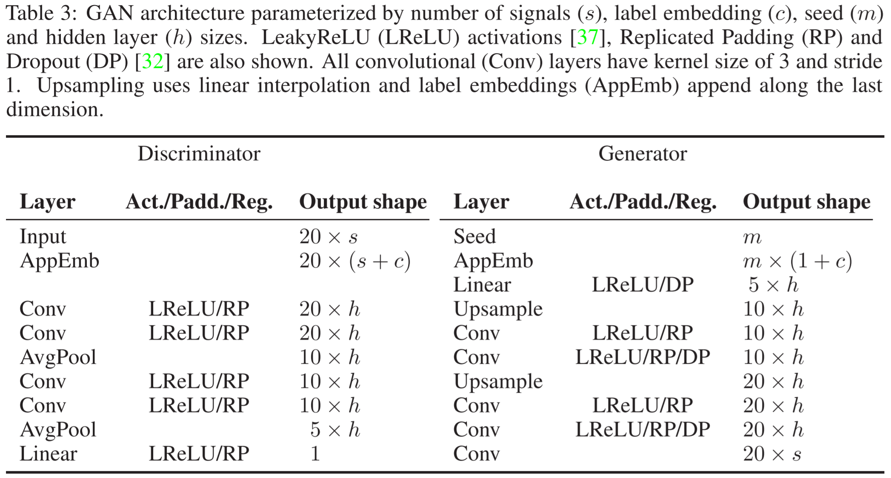

---   
<div align="center">
 
# Ward2ICU


[](https://arxiv.org/abs/1910.00752)
[](https://research.3778.care/projects/privacy/)
[](https://forms.gle/e2asYSVaiuPUUCKu8)

</div>

<!--ts-->
   * [Ward2ICU](#ward2icu)
      * [Description](#description)
      * [Models](#models)
         * [1D Conditional CNN GAN](#1d-conditional-cnn-gan)
         * [Recursive GAN (RGAN)](#recursive-gan-rgan)
         * [Recursive Conditional GAN (RCGAN)](#recursive-conditional-gan-rcgan)
         * [RNN Classifier](#rnn-classifier)
         * [1D-CNN Classifier](#1d-cnn-classifier)
      * [Citation](#citation)

<!-- Added by: severo, at: Tue Oct 22 03:59:12 -03 2019 -->

<!--te-->
 
## Description
Ward2ICU: A Vital Signs Dataset of Inpatients from the General Ward

## Models

### 1D Conditional CNN GAN
[](https://github.com/3778/data-synthesis/blob/master/ward2icu/models/cnngan.py)



### Recursive GAN (RGAN)
[](https://github.com/3778/data-synthesis/blob/master/ward2icu/models/rgan.py)
[](https://arxiv.org/abs/1706.02633)

Recursive GAN (Generator) implementation with RNN cells.

### Recursive Conditional GAN (RCGAN)
[](https://github.com/3778/data-synthesis/blob/master/ward2icu/models/rcgan.py)
[](https://arxiv.org/abs/1706.02633)

Recursive Conditional GAN (Generator) implementation with RNN cells

### RNN Classifier
[](https://github.com/3778/data-synthesis/blob/master/ward2icu/models/classifiers.py)

A simple RNN for classification tasks. It consists of a recurrent layer (Elman RNN, LSTM or GRU) followed by 2 fully connected. The first shares parameters across the time domain (i.e. second tensor dimension), while the second collapses the time-domain to a single point with a Sigmoid activation.

### 1D-CNN Classifier
[](https://github.com/3778/data-synthesis/blob/master/ward2icu/models/classifiers.py)

Single-dimension convolutional network for classification. Consists of a sequence of `Conv1d` followed by `MaxPool1d` and `Linear` with a `Sigmoid` output.

## Citation   
```
@article{severo2019ward2icu,
  title={Ward2ICU: A Vital Signs Dataset of Inpatients from the General Ward},
  author={Severo, Daniel and Amaro, Fl{\'a}vio and Hruschka Jr, Estevam R and Costa, Andr{\'e} Soares de Moura},
  journal={arXiv preprint arXiv:1910.00752},
  year={2019}
}
```
